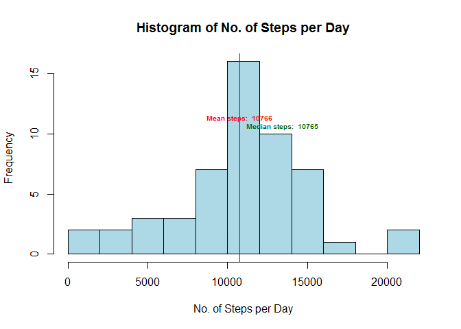
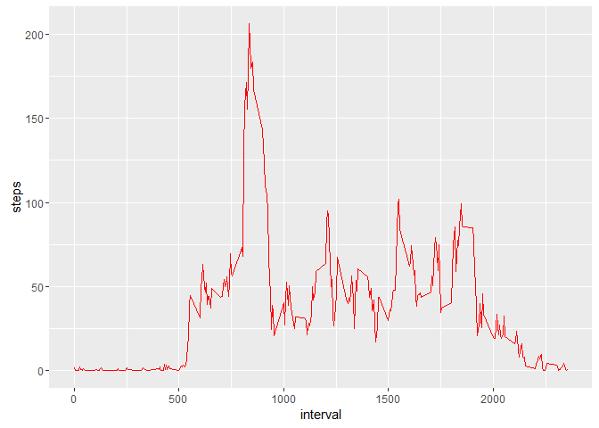

# Reproducible Research: Peer Assessment 1


## Loading and preprocessing the data

```r
library(lattice)
library(ggplot2)
library(dplyr)

if(!file.exists('activity.csv')){
        unzip('activity.zip')
}

if (!file.exists("actData")){
        actData<-read.csv("activity.csv")
}

summary(actData)
```

```
##      steps                date          interval     
##  Min.   :  0.00   2012-10-01:  288   Min.   :   0.0  
##  1st Qu.:  0.00   2012-10-02:  288   1st Qu.: 588.8  
##  Median :  0.00   2012-10-03:  288   Median :1177.5  
##  Mean   : 37.38   2012-10-04:  288   Mean   :1177.5  
##  3rd Qu.: 12.00   2012-10-05:  288   3rd Qu.:1766.2  
##  Max.   :806.00   2012-10-06:  288   Max.   :2355.0  
##  NA's   :2304     (Other)   :15840
```

```r
str(actData)
```

```
## 'data.frame':	17568 obs. of  3 variables:
##  $ steps   : int  NA NA NA NA NA NA NA NA NA NA ...
##  $ date    : Factor w/ 61 levels "2012-10-01","2012-10-02",..: 1 1 1 1 1 1 1 1 1 1 ...
##  $ interval: int  0 5 10 15 20 25 30 35 40 45 ...
```

```r
actData$date<-as.Date(actData$date)    # Make the column "date" of type Date.
```

## What is mean total number of steps taken per day?

```r
stepsDay<-aggregate(steps~date, data = actData, sum) # Sum total steps per day, na's are ignored by default
meanSteps<-mean(stepsDay$steps)
medianSteps<-median(stepsDay$steps)

hist(stepsDay$steps, col = "lightblue", breaks = nrow(stepsDay)/5, 
     main = "Histogram of No. of Steps per Day", xlab = "No. of Steps per Day")
abline(v=meanSteps, col = "red")
abline(v=medianSteps, col = "darkgreen")
text(c(meanSteps, medianSteps),nrow(stepsDay)/5,
     c(paste("Mean steps: ", round(meanSteps,0)), paste("Median steps: ", round(medianSteps,0))),
     pos=c(3,4), cex=.6, font = 2, col = c("red", "darkgreen"))
```

\


## What is the average daily activity pattern?

```r
stepsInterval<-as.data.frame(aggregate(steps~interval, data = actData, mean))

ggp<-ggplot(stepsInterval, aes(interval, steps)) 
ggp<-ggp+geom_line(colour="red")
print(ggp)
```

\

```r
maxSteps<-subset(stepsInterval, stepsInterval$steps==max(stepsInterval$steps))
paste("5-minute interval with maximum number of steps is ", maxSteps$interval, " with an average of ", round(maxSteps$steps), " steps")
```

```
## [1] "5-minute interval with maximum number of steps is  835  with an average of  206  steps"
```

## Imputing missing values
I chose to impute the missing values with the average per interval computed earlier in this report.

```r
paste("Number of missing values is ", sum(is.na(actData$steps)))
```

```
## [1] "Number of missing values is  2304"
```

```r
actData2<-merge(actData, stepsInterval, by = "interval")
actData2$steps.x[is.na(actData2$steps.x)]<-actData2$steps.y[is.na(actData2$steps.x)]     # Missing values are imputed
actData2<-actData2[,1:3]
names(actData2)[names(actData2) == 'steps.x'] <- 'steps'

stepsDay2<-aggregate(steps~date, data = actData2, sum) # Sum total steps per day
meanSteps2<-mean(stepsDay2$steps)
medianSteps2<-median(stepsDay2$steps)

hist(stepsDay2$steps, col = "lightblue", breaks = nrow(stepsDay2)/5, 
     main = "Histogram of No. of Steps per Day", xlab = "No. of Steps per Day")
abline(v=meanSteps2, col = "red")
abline(v=medianSteps2, col = "darkgreen")
text(c(meanSteps2, medianSteps2),nrow(stepsDay2)/5,
     c(paste("Mean steps: ", round(meanSteps2,0)), paste("Median steps: ", round(medianSteps2,0))),
     pos=c(2,4), cex=.6, font = 2, col = c("red", "darkgreen"))
```

\

Mean and median steps are comparable when missing data were not filled.


## Are there differences in activity patterns between weekdays and weekends?

```r
actData3<-mutate(actData2, dayType=as.factor(weekdays(actData2$date, abbreviate=TRUE)))
print(unique(actData3$dayType))
```

```
## [1] ma vr zo di za do wo
## Levels: di do ma vr wo za zo
```

```r
levels(actData3$dayType)<-list(Weekday=c("ma", "di", "wo", "do", "vr"), 
             Weekend = c("za", "zo"))

print(unique(actData3$dayType))
```

```
## [1] Weekday Weekend
## Levels: Weekday Weekend
```

```r
group_by<-group_by(actData3, interval, dayType)
intervalDaytype<-summarize(group_by, steps = mean(steps))

ggp<-ggplot(intervalDaytype, aes(x=interval, y=steps)) 
ggp<-ggp+geom_line(colour="red")+
        facet_grid(dayType ~ .)+
        xlab("5 Minute Interval") +
        ylab("Number of steps")
print(ggp)
```

\
